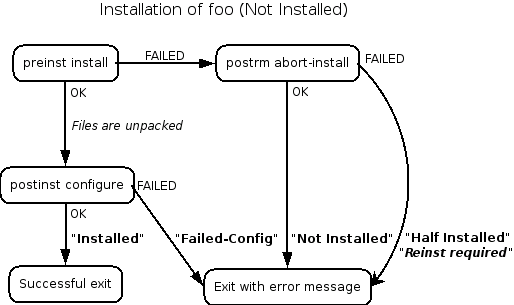

# dbconfig-mysql

Type: deb
Created By: 建忠林

自動化腳本debian packages: config, postinst, preinst, postrm, prerm
情境: mysql安裝時候會幫忙使用者自動化很多小細節，通常都包裝好，如需要客製化需要先理解原理

[MaintainerScripts](https://wiki.debian.org/MaintainerScripts)

DEBIAN 雖然有解釋，但是不夠細節對於debconfig，以下作補充，希望套件都能一鍵安裝好QQ

preinst → unpack (rules file) → config → postinst

remove part:

purge part:

